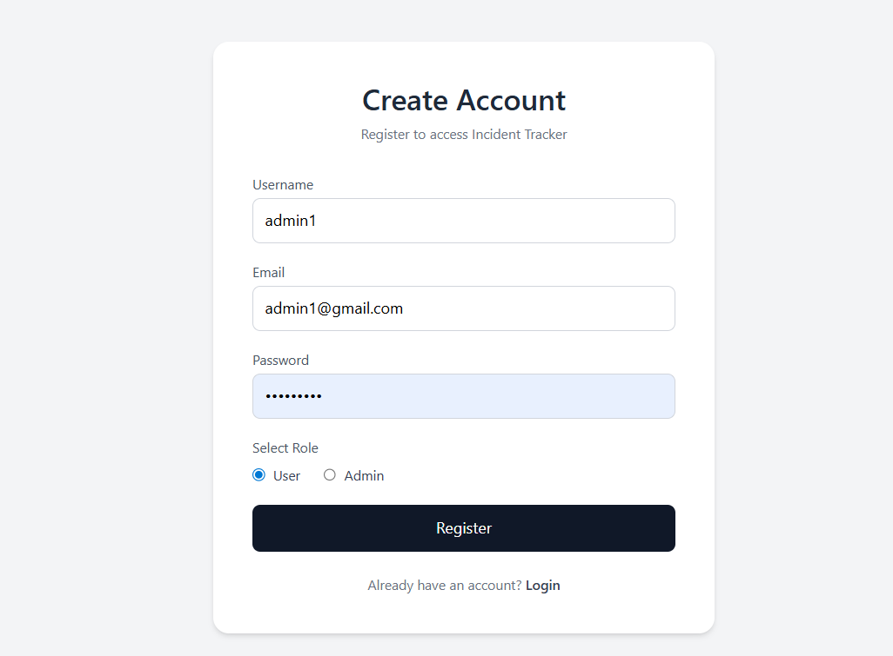
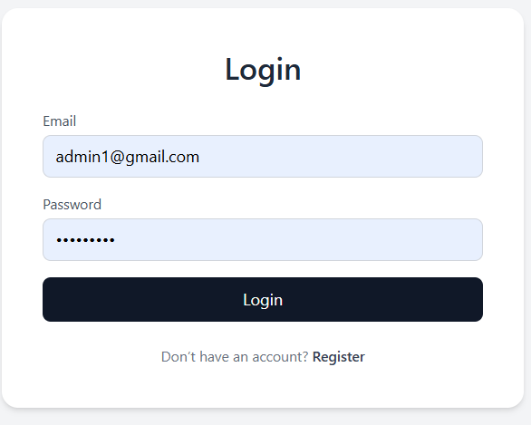
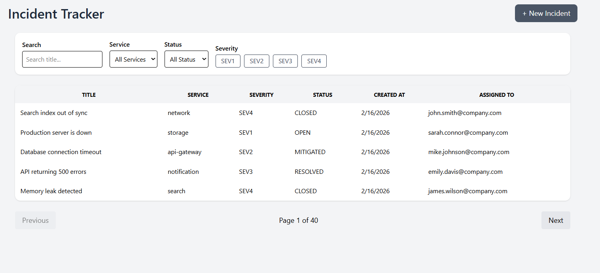
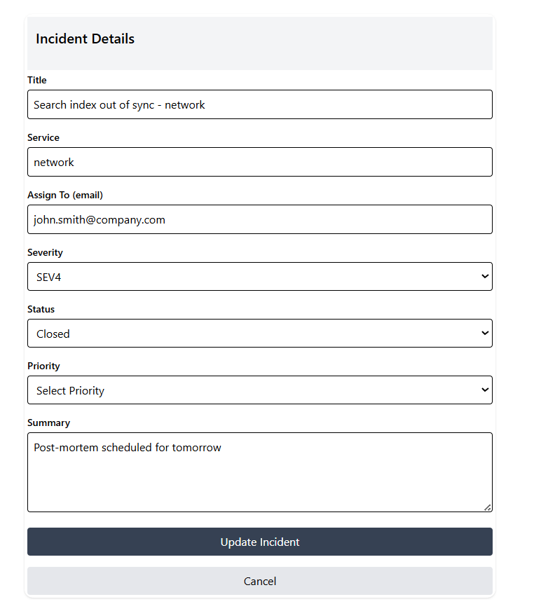
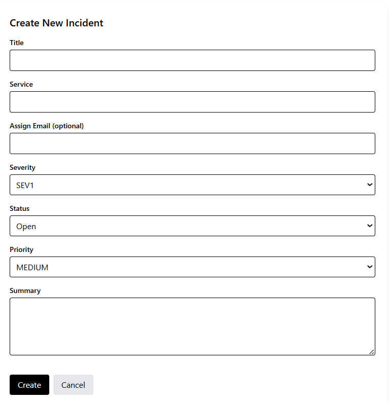

# 🚀 Incident Tracker Mini App

A full-stack application to create, browse, filter, and manage production incidents.

This project demonstrates:

- ✅ Backend API design  
- ✅ MongoDB indexing  
- ✅ Server-side pagination  
- ✅ JWT authentication (HTTP-only cookies)  
- ✅ Clean architectural separation  

---

# 🛠 Tech Stack

## 🔹 Backend
- **Node.js** – Runtime environment  
- **Express.js** – Web framework  
- **MongoDB** – Database  
- **Mongoose** – ODM  
- **JWT** – Authentication via HTTP-only cookies  
- **Zod** – Request validation  
- **bcrypt** – Password hashing  
- **express-mongo-sanitize** – NoSQL injection protection  

---

## 🔹 Frontend
- **React (Vite)** – UI framework  
- **Tailwind CSS** – Styling  
- **Axios** – HTTP requests  

---

# 📋 Prerequisites

Make sure you have installed:

- **Node.js (v18+)**
- **MongoDB** (local instance or MongoDB Atlas URI)
- **npm**

---

# ⚙️ Installation Guide

## 1️⃣ Clone Repository

```bash
git clone <repository-url>
cd incident-tracker
```

---

# 🔧 Backend Setup

### 1. Navigate to backend folder

```bash
cd backend
```

### 2. Install dependencies

```bash
npm install
```

### 3. Create `.env` file inside backend

```
PORT=5000
mongo_url=mongodb://localhost:27017/incident-tracker
JWT_SECRET_KEY=your_super_secret_key
CLIENT_URL=http://localhost:5173
```

### 4. Start development server

```bash
npm run dev
```

### 5. Seed Database (Optional)

```bash
npm run seed
```

This will create:
- 👤 20 sample users (admin + user)
- 📌 200 sample incidents

---

# 🎨 Frontend Setup

### 1. Navigate to frontend folder

```bash
cd frontend
```

### 2. Install dependencies

```bash
npm install
```

### 3. Create `.env` file inside frontend

```
VITE_SERVER_URL=http://localhost:5000
```

### 4. Start frontend server

```bash
npm run dev
```

Frontend will run at:

```
http://localhost:5173
```

---

# 🔐 Authentication Flow

1. Register yourself  
2. Login  
3. Incident dashboard will open  
4. Top-right corner:
   - ➕ **New Incident** → Create new ticket  
5. Click any ticket → View full details  

---

# 📡 API Endpoints

## 🔑 Auth Routes

| Method | Endpoint | Description |
|--------|----------|------------|
| POST   | `/api/auth/register` | Register new user |
| POST   | `/api/auth/login`    | Login & set cookie |
| POST   | `/api/auth/logout`   | Logout & clear cookie |

---

## 📌 Incident Routes

| Method | Endpoint | Description |
|--------|----------|------------|
| POST   | `/api/incidents`     | Create new incident |
| GET    | `/api/incidents`     | Get incidents (filter + pagination + sorting) |
| GET    | `/api/incidents/:id` | Get incident by publicId (UUID) |
| PATCH  | `/api/incidents/:id` | Update incident |

---


# 🏗 Project Structure

```
incident-tracker/
│
├── backend/
│   ├── src/
│   ├── modules/
│   ├── routes/
│   ├── services/
│   └── models/
│
└── frontend/
    ├── src/
    ├── components/
    ├── pages/
    └── hooks/
```

---

# ✨ Features

- 🔐 Secure JWT authentication (HTTP-only cookies)
- 👥 Role-based access (admin / user)
- 📌 Create & update incidents
- 🔎 Filtering (service, severity, status)
- 🔍 Debounced search
- 📄 Server-side pagination
- ⬇ Sorting by created date
- 🎨 Clean UI with Tailwind

---

# 📌 Notes

- Make sure MongoDB is running before starting backend.
- Restart frontend after modifying `.env` files.
- Ensure `JWT_SECRET_KEY` is properly set.

---

# 👨‍💻 Author

**Ankan Kumar**

---

⭐ If you like this project, consider giving it a star!


# Screenshots of Application
1. Registration

2. Login

3. Incidents-List

- here you can search by title , service, serverity , email
4. Incident-Details

5. Incident-Creation
